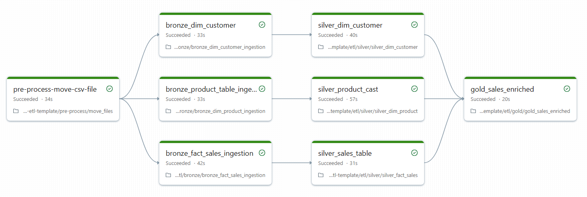

# PySpark ETL Template Documentation

## Summary 

This project demonstrates a PySpark-based ETL template designed to process data from multiple source systems stored in a data lake such as **Amazon S3** or **Azure Data Lake Gen2**.

All source data is stored in **CSV format**; however, the **delimiter varies across files**. The solution is designed to be **scalable, robust, and extensible, capable** of handling schema consistency issues, data quality challenges, and analytical requirements.

## Solution Architecture
#### 1. Architecture Overview

I have used Databricks features and created an **end-to-end ETL** pipeline. I have used the medallion architecture **(Bronze, Silver, Gold)** pattern. I have written all code in class and object style, because we can easily achieve scalable, reliable transformations and business-ready analytics for sales data.
The architecture uses Databricks **Auto Loader, Structured Streaming, Delta Lake, and Unity Catalog**. Using **SCD Type 1** and **SCD Type 2**.
In this project,  I ensure data quality, reliability, and governance.

**Project folder structure** 

pyspark-etl-template/
├── config
│ └── config
| └── sqlconfig
├── create_table
| └── create_table_script
├── etl
│ ├── bronze
│ │ ├── bronze_dim_customer_ingestion
│ │ ├── bronze_dim_product_ingestion
│ │ └── bronze_fact_sales_ingestion
| | └── read-input-data-backup
│ ├── silver
│ │ ├── silver_dim_customer
│ │ ├── silver_dim_product
│ │ ├── silver_fact_sales
│ └── gold
│ └──── gold_sales_enriched
├── pre-process
│ └── move_file
└── temp

**ETL Workflow Diagram**

## Business Requirements
### Task 1

Identify the number of customers who have registered or signed in but have never made a purchase in their lifetime.

### Task 2

Determine the top 10 customers on a weekly basis based on total spending on the platform or website

## Data Challenges
### Challenge 1: Multiple CSV Delimiters

The source CSV files use different delimiters. PySpark does not natively support reading CSV files with multiple delimiters, nor does it automatically detect delimiters.

**Solution Requirement:**

Build a scalable and robust mechanism to handle CSV files with varying delimiters.

Ensure the solution can be easily extended to support new delimiter types in the future.

### Challenge 2: Duplicate Records

The source CSV files may contain duplicate records, which can negatively impact analytics and reporting accuracy.

**Solution Requirement:**

Implement deduplication logic to ensure data consistency and correctness before downstream processing.

## Design Principles

- Scalable ETL architecture using PySpark 
- Config-driven data ingestion 
- Robust handling of inconsistent input formats 
- Data quality checks (null handling, deduplication) 
- Reusable and modular ETL components 
- Suitable for batch and micro-batch processing

### Technology Stack

- Apache Spark (PySpark)
- Amazon S3 / Azure Data Lake Gen2 / Databricks
- CSV file format
- Delta Lake / Lakehouse Architecture (optional).

### Future Enhancements

- Automatic delimiter detection
- Schema evolution support
- Data quality metrics and monitoring
- Unit and integration test coverage
- Performance optimizations (partitioning, Z-ordering)

#### Author
**Shiva Manhar**